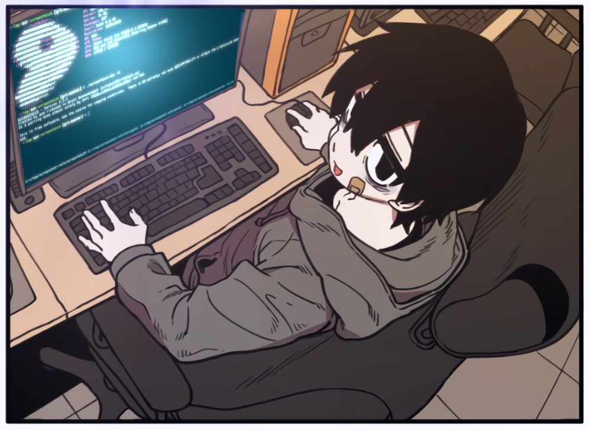

<!-- 
  
 -->

> - 🔭 I’m currently working on **Godot** because Unity is too heavy for my Mac...
>
> - 🌱 I’m currently learning **3D Development in Godot**
>
> - 💬 Ask me about **anything**
>
> - ⚡ Fun fact **My profile picture was generated with Stable Diffusion trained with my Photos!**

 

<!-- 

 -->

  
  
  

